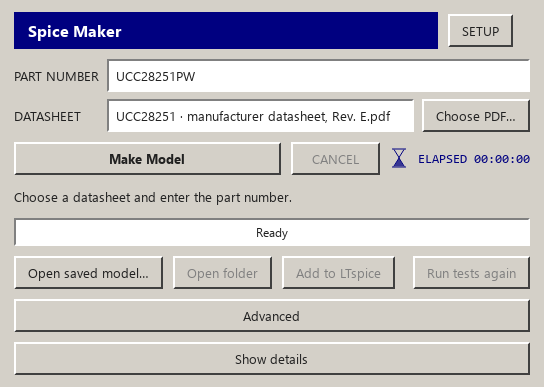
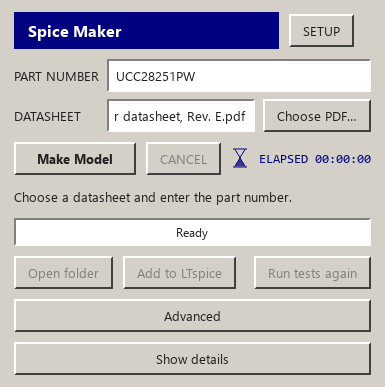

# Automatic workflow and manufacturer-original milestone

The owner authorized one hour, starting 2026-10-01 01:42:19 UTC, with both main branches
uploaded at the end. This milestone implements the clarified two-input UI and an official
manufacturer-first acquisition route; it does not claim a completed universal generator.

## Observed source run

The owner's unchanged UCC28251 Rev. E PDF SHA-256 is
`81a4414e6f2d7de81398bba5f7ceffb2f4f117dbc005a8c9e157b372646dc602`.
The default full run for UCC28251PW took **62.842 seconds**, with **15 PASS, 0 FAIL,
21 UNKNOWN, 8 NOT_APPLICABLE** and **zero AI provider calls**. Actual simulation accounted
for 50.855 seconds; extraction 5.344 seconds, document registration 4.157 seconds and
manufacturer lookup 2.042 seconds. These are measured times, not estimates.

TI's actual [product page](https://www.ti.com/product/UCC28251) linked an unencrypted
PSpice average package and TINA-TI average model. The original PSpice model was inspected
unchanged, then the configured LTspice produced real raw/log files and a singular-matrix
diagnostic at the generic unpowered operating point. That check is **inconclusive**; it
does not prove compatibility or incompatibility in a powered supplier reference circuit.
TINA bytes were not inspectable plaintext. Both reasons were retained in official-model.json
before the existing cited code-built controller route ran. No adaptation or AI repair occurred.

The delivered generated library SHA-256 remains
`c1f6947332b9ba311e3b81654def87cd43bfae3378c67b595d8801def302273b`.
The fixed source tests and explicitly incomplete scope remain unchanged.

## UI and supplier-original controls

The normal desktop now shows datasheet and part number, with routing and custom destination
under Advanced. Gray bevels, navy activity/timer and the two-window setup are retained.
Quoted paths, native file dialogs, an All files filter, explicit part input, local PDF copy
drops and package ambiguity have focused controls. Actual Qt screenshots are below.

Official acquisition accepts inspected plaintext/ZIP originals and contained dependencies,
refuses executables/encryption/unsafe paths/external read-write directives, and keeps source
bytes and hashes. Two real LTspice fixture checks load an original subcircuit and diode
primitive without changing bytes. Synthetic route tests cover priority before the old part
whitelist, entry mismatch, MCU exclusion, no AI requests and honest UNKNOWN accuracy.

## Remaining engine work

- Resolve more official manufacturer product/model pages; current automatic discovery is TI/ADI.
- Freeze and run independent datasheet electrical tests for imported originals, with measured
  operating conditions and supplier model scope. The generic load check alone remains UNKNOWN.
- Replace the generated-route exact part/PDF registry with source-derived physical pin contracts
  and reviewed reusable electrical behavior composition. Current generated family coverage is narrow.
- Expand a real multi-manufacturer component corpus before claiming broad PCB coverage. Keep MCU,
  FPGA, CPLD, processor and SoC exclusions. Pin-only output never represents component function.

No vendor model packages, owner PDFs, waveform dumps, keys or private configuration are committed.

## General release verification

Final full offline command: `python -m pytest -q -m "not ltspice and not network"`:
**2485 passed, 24 skipped, 193 deselected**, 235.14 s. Ruff check/format and git diff
checks pass. Shared-core manifest covers 72 identical files. Final focused acquisition,
authority, delivery, reopening and PDF-workflow controls: 160 passed, 2 real-LTspice
checks deselected (those two ran separately and passed).

`installer/build.ps1 -Version 1.8.1` passed. Actual installed wheel and frozen desktop
fingerprints match General source:
`e1e9be2e615f7940fc3c83a985bf0b7675f193d4e2226e645de8e718c69a3b07`.
Fresh installs, in-folder updates, two-copy isolation, responsive GUI and absence of
new external setup entries were measured. Installer SHA-256:
`c416ccb8430eb0d66b63eb6d7a9fb75db6684510be93c4fa74783b8bca11c14b`.

Actual installed default builds completed in **50.161 s (wheel)** and **49.289 s
(frozen desktop)**. Both retain zero AI calls, exact design association and the same
15 PASS / 0 FAIL / 21 UNKNOWN / 8 NOT_APPLICABLE verdict. Both generated examples run
in LTspice. Full hashed receipts: [installed acceptance](general-installed-acceptance.json).

## Bob release verification

Final full offline command: `python -m pytest -q -m "not ltspice and not network"`:
**2250 passed, 30 skipped, 190 deselected, 4 warnings in 228.48s (0:03:48)**. Installation instructions: 9 passed. Ruff check/format and diff checks pass;
72 shared files are identical. The edition-specific legacy prompt/repair path is preserved.

`installer/build.ps1 -Version 1.8.1` passed actual fresh installation, update, two-copy
isolation, responsive frozen GUI and source/wheel/desktop identity checks. Final source:
`e1452ef67d7165914c36bc51cd84a166f379c128b515eac63a18f54847eea73b`.
Installer SHA-256:
`919de05c38ce122c4a4d6f10fcdacf70f4374f858360461f8879abaf73880ad4`.
An independent archive check confirms the release ZIP contains that exact installer and
matching checksum/version records. ZIP SHA-256:
`ddd822b12c936dd758f6a902d4799d0056fb6da1243030fcc9595cec5296add4`.

Actual installed default UCC28251PW builds take **52.506 s (wheel)** and **49.873 s
(frozen desktop)**. Both retain zero AI calls, exact design association and the same
15 PASS / 0 FAIL / 21 UNKNOWN / 8 NOT_APPLICABLE verdict. Library, symbol, specification,
design and pinout hashes agree between installed surfaces. Both generated examples run
in LTspice. Full hashed receipts: [Bob installed acceptance](bob-installed-acceptance.json).

The owner's existing running app and Downloads files were not changed in this hour.
Use the versioned 1.8.1 release for these changes; already running older installations
do not update themselves. All vendor packages and simulator waveforms remain local.
