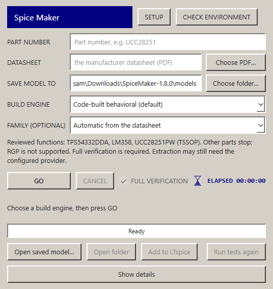

# PWM engine and verified desktop 1.8.0 delivery

The supplied UCC28251 Rev. E PDF now produces a functional first-order **PW/PWR TSSOP primary-side PWM controller** through the actual installed wheel and frozen desktop engine. All four default builds delivered identical library, symbol, specification, design and pinout identities. Each records 15 PASS/0 FAIL/21 UNKNOWN/8 N/A and zero provider calls with complete accounting. Overall status remains UNKNOWN; this is limited scope, not complete controller or power-converter qualification.

## Cause and implementation

The owner's old 1.7.0 installation read the 58-page PDF successfully, then spent about 20 minutes in legacy AI test planning before timing out. Embedded PDF text was present; OCR was not the cause. The newer source engine beside the installation had never reached its installed wheel and frozen executable. Version 1.8.0 replaces that mismatch and exposes the actual source-policy fingerprint in `version --json`.

The [unchanged original guide](../../engine-refactor.html) has SHA256 `9637137e2f3533210975d7e49c3a20def816c468ed60491c86fba38bfbce38e8`. [ENGINE_GUIDE.md](../../ENGINE_GUIDE.md) records the contract: cited facts→typed design→deterministic SPICE; source-frozen tests; exact delivered-file provenance; explicit legacy AI only; no silent fallback. The [PWM source audit](../2026-09-30-ucc28251/REPORT.md) records the three manufacturer documents, PW physical map, reviewed facts, fifteen fixed probes, ten wrong candidates and eleven actual fault observations. Every fault observation is FAIL against unchanged source bands. The combined wrong ILIM threshold/long-delay control fails independently in both tests.

This release uses a partial, reviewed 44-row extraction for the exact source hash. It does not claim that every datasheet statement was extracted. OCR stays conditional for pages lacking usable embedded text. No project provider was called for these reviewed builds. Other unsupported part/revision/package inputs stop before paid extraction when existing publication policy prevents delivery. MCU/FPGA/CPLD/processor/SoC remain excluded on every route.

## Installed default-route timing

| Edition / surface | Reviewed extraction/citation checking | Code compile | LTspice checks | Pipeline total | Provider calls |
| --- | --- | --- | --- | --- | --- |
| General / installed_wheel | 2.872 s | 0.001 s | 44.871 s | 50.698 s | 0 |
| General / frozen_cli | 2.999 s | 0.004 s | 44.835 s | 50.888 s | 0 |
| Bob / installed_wheel | 2.752 s | 0.001 s | 44.487 s | 50.525 s | 0 |
| Bob / frozen_cli | 3.105 s | 0.002 s | 45.212 s | 51.344 s | 0 |

These are observed pipeline totals, not cross-machine guarantees. Process startup and receipt inspection add a small amount outside those totals. The historical 38-second/14-probe source run is superseded. The timing ledger's `author` stage includes compilation and simulation; its label does not mean AI authored this model. Every bench is bounded to 120 seconds and 64 MiB waveform output. Installed simulator receipts retain actual raw/log/deck hashes in [acceptance-receipts.json](acceptance-receipts.json).

## Exact artifacts and circuit viability

- Supplied datasheet SHA256: `81a4414e6f2d7de81398bba5f7ceffb2f4f117dbc005a8c9e157b372646dc602`.
- Delivered library: `c1f6947332b9ba311e3b81654def87cd43bfae3378c67b595d8801def302273b`.
- Delivered symbol: `8f0905d90ced9e4511c04cf10d6851d3e744de48f0aa4f4bc5f3485fa4853702`.
- Frozen specification: `f6f5795e57272747c63f6a9dd6a5e356e0be8712fd5f9b35acad5dd445e68441`.
- Canonical typed design: `303ef0b1cb2710e5e9e25ad0807abf43b88bf991a54315d5012b84bd4806fbdf`.
- Source-backed PW pinout contract: `a0e16a921febd2c77f968fe28594f5406a57197a57fa8b7435013a33d244d764`.

Each installed route also ran its exact generated neighboring `example.cir`, with the delivered library included by relative filename. The Figure 33 configuration has external VSENSE1→VREF7, COMP→FB/EA− and command-driven REF/EA+. Actual example observations showed about 99.542 kHz primary frequency, COMP about 1 V, an active ramp and zero interlock violations. This exercises the amplifier feedback configuration as a controller circuit; no complete transformer/power-stage or prebias-converter claim follows from it.

The reviewed domain is 25°C, RT 75k / SP 20k, primary-side, resistor-timed, level-enabled operation. Secondary prebias servo, primary SR startup ramp/handover, external sync, pulse enable, full HICC/duty-match recovery, minimum pulse width and thermal/statistical behavior remain unqualified. Numerical assumptions and the 420 mV typical COMP floor remain explicitly labeled in the typed design and model card. Bare UCC28251 requires package selection; RGP/QFN publication remains blocked pending separate pin-map corroboration.

## Retest and software checks

Saved full verification now tests existing `.lib`/`.asy` bytes in a GUI worker. It does not regenerate the candidate. It checks the fixed spec against prior identities, refreshes measured counts/results, compares restored design parameters with a canonical design built from the frozen facts, and binds current pinout/design reports to the exact files. Edited design+library+matching hashes cannot self-certify against unchanged source values. Scope and numerical assumptions survive retesting; unverified citations remain UNKNOWN through repeated retests. Historical receipts are archived.

Independent final retest/provenance/GUI review: 43 tests passed per edition. The PWM source/design/measurement regression: 34 passed with actual LTspice, including all fifteen nominal checks and eleven fault observations. Full offline source verification:

- General: 2371 passed, 24 skipped, 191 deselected in 157.70s (0:02:37); installation instructions: 9 passed.
- Bob: 2124 passed, 31 skipped, 188 deselected, 4 warnings in 138.99s (0:02:18); installation instructions: 9 passed.

Both Ruff check/format checks pass; 71 shared core files are byte-identical; whitespace checks pass. The installer upgrade fixtures cover seven actual compiled-C# scenarios, including equal-version stale fingerprints, checksum failure, staged validation failure, rollback and linked-path refusal.

## Current desktop and release

The gray beveled desktop follows the owner's GUI reference with navy headings, a blue segmented activity bar and retained elapsed timer. It makes saved limited UNKNOWN models explicit, keeps test counts visible and puts diagnostics under Show details. Default saves use one folder per part. The installer uses the same compact style. This retains the desktop decision; terminal-app was not merged.

`installer/build.ps1 -Version 1.8.0` completed for both editions. Actual frozen windows were opened, checked responsive, visually inspected and closed. Fresh isolated installs, same-folder updates and two-copy isolation passed. The actual previous General 1.7.0 and Bob 1.6.0 installers were then installed in controlled folders and upgraded using the final 1.8.0 installer. Their interpreter, `pyvenv.cfg`, configuration and model sentinels were byte-preserved; installed wheel and desktop fingerprints match source.

| Edition | Install.exe SHA256 | Current wheel/desktop/source policy SHA256 |
| --- | --- | --- |
| General | `7a0d0378cc5c08a4a1c830a156341f31b36a64efbd1929ec4443914e44130a04` | `d65297cf065648b923925e1e96f68402c2feea12665d2fd4407a14d3eb67dc95` |
| Bob | `5e9ea758ed3ef0a5aa61b48b4d50b551d67f903cf06dc7185dd857c6a35ac9ec` | `9bef6a182112c87ceabaf7c65076e2c0cd2592249527f0ba8328d5b7d671f75c` |

Normal downloads are the curated versioned application ZIP with just Install.exe, Read me.txt and SHA256SUMS.txt. README installation uses HTTPS and a failing checksum guard before setup. It makes no unsigned-publisher or Windows-protection bypass claim. Source history and prior README/HANDOFF records remain under docs/archive for RAG. Vendor PDF/model binaries, private configurations and waveform files are not published.

## Public release and owner-folder completion

Both engine milestones were pushed to main: General `b33d632`, Bob `84716a4`. GitHub Windows CI passed: [General 36697948093](https://github.com/BasamAhmed640/spice-maker/actions/runs/36697948093), [Bob 36697972483](https://github.com/BasamAhmed640/spice-maker-bob/actions/runs/36697972483). The versioned [General 1.8.0](https://github.com/BasamAhmed640/spice-maker/releases/tag/v1.8.0) and [Bob 1.8.0](https://github.com/BasamAhmed640/spice-maker-bob/releases/tag/v1.8.0) application downloads are published.

Fresh downloads from those public GitHub asset URLs matched the exact checked local ZIP and installer hashes. Fresh silent installs completed in 21.052 s General and 22.892 s Bob. Both actual public desktop windows opened, responded and closed successfully. Bob's public wheel/frozen fingerprints match the previously measured Bob release sources; the General public install ran the actual final model journey and unchanged saved-file retest.

| Public ZIP | SHA256 |
| --- | --- |
| SpiceMaker-1.8.0-Windows-x64.zip | `e54e1bb9348735d7e86e7094d3048176c4830a2743ceebeb4d036780f62bf78e` |
| SpiceMakerBob-1.8.0-Windows-x64.zip | `ba371e80d4b6d8d3053dce2f0f0dd7765fd4a3e40bb97b09790a9600c7b1a3d8` |

The owner's final model is in `Downloads/SpiceMaker-1.8.0/models/UCC28251PW`. The fresh public frozen engine completed the default build in 50.655 s, with 15 PASS / 0 FAIL / 21 UNKNOWN / 8 N/A, complete zero-AI accounting and the same exact model/design/spec/pinout identities listed above. Its generated feedback/ramp example passed real LTspice. An actual saved-file retest took 45.445 s, preserved library/symbol/spec/design identity, retained all counts/scope and kept exact canonical design association. The model card still explicitly carries the partial-evidence scope and numerical assumptions.

Private existing settings were carried into the new local data folder without logging or publication. The selected simulator was retained and default saves were moved inside the current app's models folder. The specifically identified old app folder and old/source ZIP were moved under `Previous downloads`, alongside the current release ZIP. Their original configuration, models and failure logs remain intact; the historical result-file hash was checked before/after the move. Zero files were deleted. The original datasheet and unrelated Downloads items were left in place. Historical receipts retain their original path names.

[public-delivery-receipts.json](public-delivery-receipts.json) contains the non-secret download, source-identity, actual model/retest, GUI and preservation observations. Private config/key bytes are excluded. Model waveform files remain local. `Start.cmd` starts the current app.

This completes the scoped PWM failure, desktop/download refresh and identified Downloads cleanup. It does not establish universal functional support, full UCC prebias/hiccup behavior or unreviewed RGP mapping. Future device families still need their own reviewed evidence, implementation and independent measurements.
