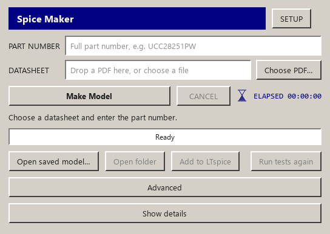
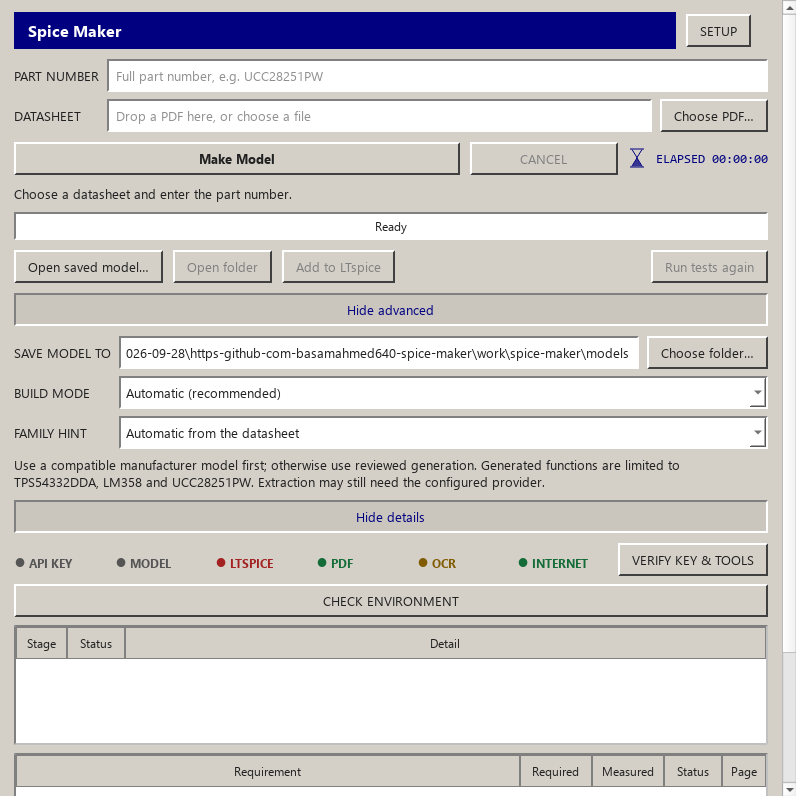
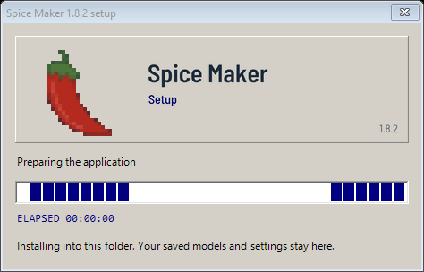
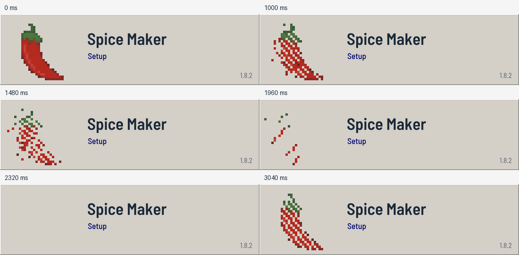

# Resize fixes, pixel pepper and two real datasheet checks

The owner authorized these GUI fixes and new PDF checks, then imposed a 45-minute
limit at 2026-10-01 03:06:23 UTC. Deadline: 03:51:23 UTC. This milestone changes
layout and delivery; it adds no clock-buffer or ADC electrical implementation.

## Observed defects and intended correction

Maximizing and opening Advanced/Details could call resize(), leave the maximized
state and overwrite the saved compact window size. Expanding both panels raised
the top-level minimum height past the available screen. Extra space stretched the
timer row instead of remaining below the compact form. New lifecycle controls
reproduce three old-code failures; the setup baseline passes. Corrections preserve
window state, allow expanded content to scroll and retain compact row heights.

The owner's Desktop/GUI_INSPO images provide the gray bevel/navy and square-pixel
visual direction. The original generated pepper GIF was not used by the real
folder-local setup. The new animation is embedded and displayed in that installer;
the elapsed timer and existing setup behavior remain. File selection remains native
and functional; this milestone does not recreate Windows Explorer inside the app.

## Actual default generation checks

| Requested test | General | Bob | Delivered model |
| --- | --- | --- | --- |
| CDCLVC1104, representative four-output family member | BLOCKED, 3.760 s | BLOCKED, 3.481 s | None |
| LTC2452 | BLOCKED, 3.178 s | BLOCKED, 3.174 s | None |

These are ordinary clock_timing and data_converter components, not excluded MCU/FPGA
classes. Both stop at the existing part/PDF-hash pinout profile gate before AI.
Provider calls, electrical simulations and model files: zero. The independent audit
also confirms no registered behavioral implementations for these classes. Adding
only pinout whitelist entries cannot produce functional component models.

TI's [CDCLVC1104 product page](https://www.ti.com/product/CDCLVC1104) lists SLLM088
IBIS. An IBIS file cannot be delivered as an LTspice SPICE model. The supplied
datasheet and [SCAU041 EVM guide](https://www.ti.com/lit/pdf/SCAU041), Figure 1/page 3,
agree on its eight-terminal mapping. A future reusable fanout block must cover
every output, asynchronous disable-low, voltage/current and loaded timing behavior.

LTC2452 needs sampled ADC/quantization and a bounded SPI state machine, including
conversion/sleep/data-output transitions, real SDO high impedance, restart/abort,
POR and conversion time. DFN DDB includes grounded exposed pad 9; TS8 does not.
The [ADI page](https://www.analog.com/en/products/ltc2452.html) was intermittently
available: bounded same-security-path checks observed HTTP 200 and HTTP 403.
The original app report obscured the HTTP code. The corrected acquisition code
retains the status without logging server text, query tokens or cookies. Failure
to retrieve a page is not evidence that an official model never exists.

Full sanitized source identities, pin observations, conditions, stage times and
per-edition verdicts are in [datasheet audit receipts](datasheet-audit.json).
Supplier PDFs, user PDFs, vendor models, waveform dumps and private settings stay local.

## Remaining engine work

Replace exact part/PDF-hash admission with cited runtime pin contracts; implement
reusable fanout and ADC/protocol blocks; freeze independent source tests before
rendering. Missing physics remains unsupported, and no pin shell or AI-written
candidate is silently substituted. MCU/FPGA/CPLD/processor/SoC exclusions remain.

## Final 1.8.2 verification

Both `installer/build.ps1 -Version 1.8.2` runs passed real fresh installation, update, two-copy isolation, responsive frozen GUI and source/wheel/desktop identity checks. The actual Windows window verifier completes three maximize/restore cycles per checked window and preserves its original dimensions. Source lifecycle tests additionally exercise panel toggling while maximized.

Final full offline command per edition: `python -m pytest -q -m "not ltspice and not network"`.

- General: **2497 passed, 24 skipped, 193 deselected in 197.92s (0:03:17)**. Source fingerprint `4f2f3b3b923569fd1d3430ee28d25a47cd0fa19aaf3bffbb86fb67ec8ed30d27`. Installer SHA-256 `9dde35d57370fa719ee49a9faa066dce0a479dad11d2d1601b94ea50b5b5ac03`. ZIP SHA-256 `99b0f2b0a71b3c0842ec00c0ec391be8f269e6aafd755a3e3658f42c4f4463f1`.
  Actual installed UCC28251PW totals: **53.304 s (wheel)** / **65.102 s (frozen desktop)**. [Exact installed UCC receipt](general-installed-ucc.json); [installed new-part checks](general-installed-new-parts.json).
- Bob: **2262 passed, 30 skipped, 190 deselected, 4 warnings in 182.21s (0:03:02)**. Source fingerprint `cd8d85bb93bae6d5344135c1d0721b4d6e63320e6c2866adb464493293b4e852`. Installer SHA-256 `f43f277380403280d6ad86b1e14145c4e52aad3adc2322954dca6078051ca839`. ZIP SHA-256 `26ba6efa32fa6cb6cf5b95673b37d6a65e82eea922eb8c22aed52af88e34fc7a`.
  Actual installed UCC28251PW totals: **61.633 s (wheel)** / **54.757 s (frozen desktop)**. [Exact installed UCC receipt](bob-installed-ucc.json); [installed new-part checks](bob-installed-new-parts.json).

All four UCC builds keep 15 PASS / 0 FAIL / 21 UNKNOWN / 8 NOT_APPLICABLE, zero AI calls and exact design association. Their library bytes remain `c1f6947332b9ba311e3b81654def87cd43bfae3378c67b595d8801def302273b`; generated examples also run in LTspice. These are replays of the reviewed UCC evidence and renderer, not new electrical behavior or generic AI extraction. Final full suites ran concurrently with these installed checks.

Installed frozen new-part checks: General CDCLVC1104/LTC2452 4.365 / 3.951 s; Bob 3.461 / 3.652 s. All remain BLOCKED, publish no model and record zero provider calls. Both current LTC lookups preserve HTTP 403.

General GUI/setup/file-input suite: 106 passed; Bob: 99 passed. Final focused GUI controls: 24 passed each. Independent Luna lifecycle checks: 4 passed per edition plus actual screenshot review. Animation/real C# rendering controls: 4 passed each; General real installer provisioning controls: 7 passed. Ruff check/format, diff checks and 72-file shared parity pass. An independent archive review matches installer/version/checksum records.

The existing user installation and Downloads files were not changed. Already installed older copies do not auto-update; use the verified 1.8.2 installer for these fixes. No provider calls or unbounded AI repair were requested.

Final mirroring review retains Bob's existing early stale-wheel packaging guard. The built application wheel matches all 140 current Python modules byte-for-byte; three new missing-wheel/module/stale-module controls and nine installation-instruction controls pass. Edition-specific packaging scripts/tests are excluded from automatic mirroring. Restoring this build-time check changes no runtime payload, installer resource or source fingerprint.
